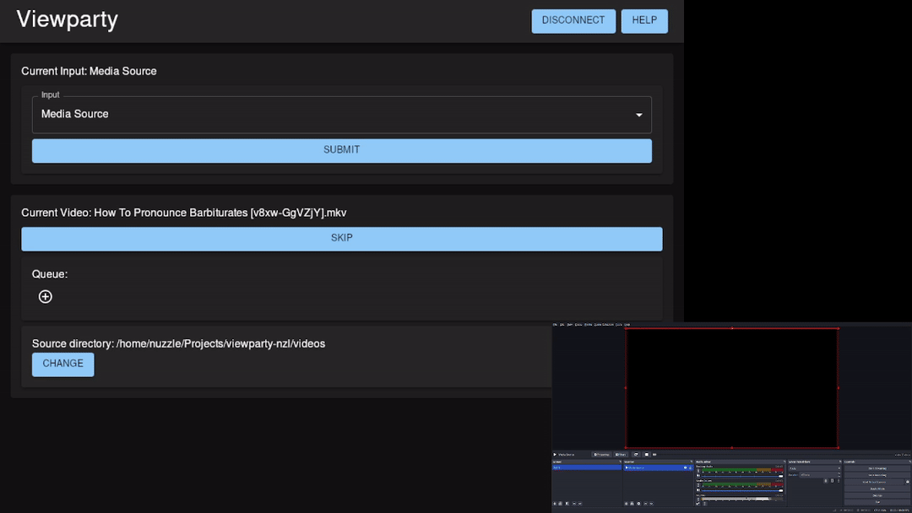

# viewparty-nzl

[//]: # 'Minesweeper-XP had badges for download counts as well.'

An app for queueing and randomizing OBS Media Source playback.

## Downloads

| Windows                                                                                                | MacOS                                                                                                | Linux (x64)                                                                                            | Linux (ARM)                                                                                              |
| ------------------------------------------------------------------------------------------------------ | ---------------------------------------------------------------------------------------------------- | ------------------------------------------------------------------------------------------------------ | -------------------------------------------------------------------------------------------------------- |
| [Download .exe](https://github.com/RareBeeph/viewparty/releases/latest/download/viewparty-windows.exe) | [Download .pkg](https://github.com/RareBeeph/viewparty/releases/latest/download/viewparty-macos.pkg) | [Download binary](https://github.com/RareBeeph/viewparty/releases/latest/download/viewparty-linux-x64) | [Download binary](https://github.com/RareBeeph/viewparty/releases/latest/download/viewparty-linux-arm64) |

## Demo

## Usage

First, download and run Viewparty.

Make sure OBS is open, and its WebSocket server is enabled (Tools > WebSocket Server Settings). This is how Viewparty communicates with the OBS instance. Default connection settings should be sufficient; but if your OBS connect info has been manually changed, you can likewise manually match those settings in Viewparty. Additionally, ensure your OBS scene contains at least one Media Source.

Once connected (on startup, or by clicking the "Connect to OBS WebSocket" button), use the "Change" button in the "Source directory" section at the bottom of the main page to select which folder your media will be sourced from. Then,

[//]: # "For advanced use: strictly speaking, only the directory's base path and file names are required on the machine which is running Viewparty, so long as they match a corresponding directory containing corresponding actual media files on the machine which is running OBS. This is technically an unsupported use case, but that doesn't need to stop you."

Once your source directory is set, you only need to use the "Input" dropdown at the top of the main page to select which Media Source to target. Once this is done, media from the selected directory should begin to play automatically, in a random order by default. To influence the order, you may use the controls in the "Queue" section, with the (+) icons adding new entries and the dropdowns on existing entries specifying which files they represent. Media to be played will be popped off the top of the queue.
